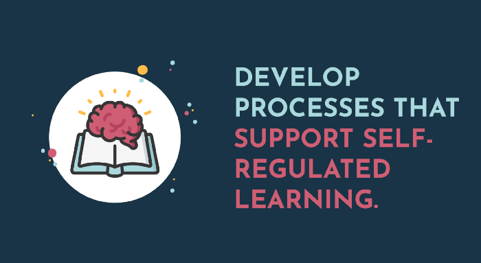
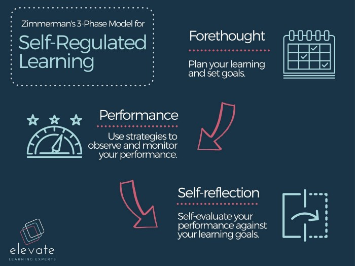
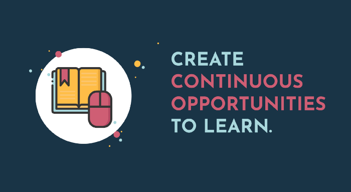
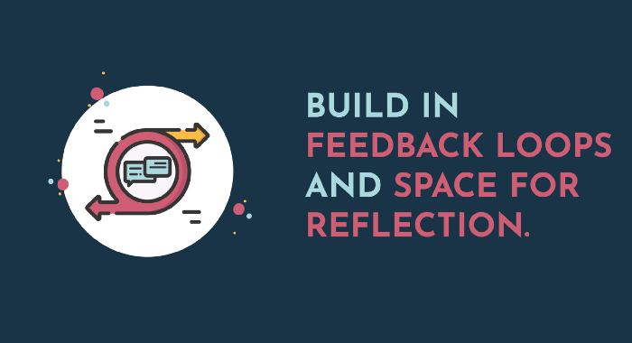
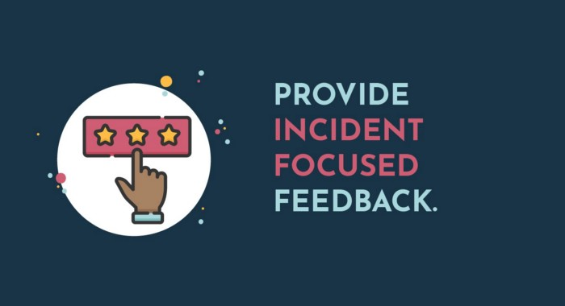
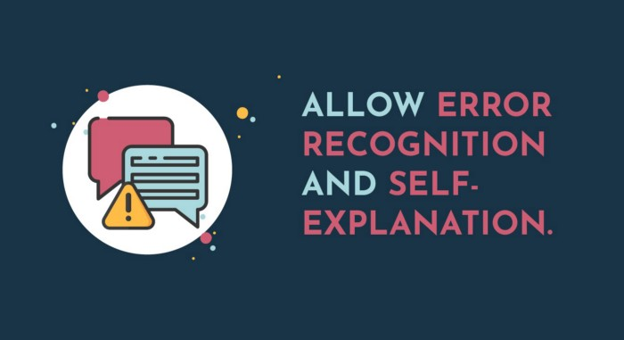

Most organisations have realised the importance of developing a learning culture — a philosophy and espousing of values that puts employee growth and development at the centre of an employee-centric value proposition and company culture. It’s an approach to learning that encourages individuals to take ownership of their personal and professional development, to learn informally, in the flow of work, and to enrol for as many online courses as they feel is necessary to improve their productivity and performance, without the fear of a clock-watching micromanager limiting their learning time for fear of lost hours.

It sounds idyllic (utopian even), but the reality is that creating a culture of learning is possible, provided leaders understand what it truly means to shift the culture, taking an incremental approach to change management and adopting and modelling the practices and behaviour of a lifelong learner themselves.

### Here are three ways you can create an organisational learning culture:

1. Develop processes that support self-regulated learning.
2. Create continuous opportunities to learn.
3. Build in feedback loops and space for reflection.

Self-regulation is so important to the formation of a culture of informal workplace learning, particularly as remote and dispersed teams become the norm. Why? Because self-regulation helps employees be proactive and self-led in their learning. They are more aware of their skill gaps and better able to plan how they will go about developing these skills. This is particularly necessary for remote workers, as many lack the opportunities for organic, face-to-face learning from senior leaders in the business and other colleagues that may occur in an office, and instead need to set their own work and learning rhythms to ensure they keep growing professionally.

The concept of self-regulation was developed by Albert Bandura, who proposed that motivation or intention isn’t enough to drive action and that people need to develop the skill of self-regulation so that they can control and direct their motivation and behaviours towards the intended outcome, be it related to their work, education, hobbies, relationships or otherwise.

> Self-regulation also encompasses the self-efficacy mechanism, which plays a central role in the exercise of personal agency by its strong impact on thought, affect, motivation, and action,” (Bandura, 1991, p. 248).

Self-reflection is thus key to self-regulation because it helps individuals develop the self-awareness to identify the actions or behaviours that need changing or the competencies needed to reach their goals. Barry Zimmerman, an educational psychologist, focused on self-regulation as it applies to learning. Zimmerman’s model indicates three key phases for self-regulated learning that emphasises planning, performing and reflecting.

Creating the processes and opportunities for employees to intentionally plan and reflect on their performance, development and goals will assist in creating a team of self-regulated learners. Once self-regulated behaviours become habitual, creating a learning culture is much more attainable, whether your team is based in an office or working remotely.

[IBM research](https://www.ibm.com/training/pdfs/IBMTraining-TheValueofTraining.pdf) shows that 84% of employees and companies in the Best Performing Organisations category receive professional training. An important step to creating a culture of learning is to create continuous opportunities to learn. This can be through online programmes, accredited courses, mentorships, forums or communities of practice or feedback loops.

Here are a few ways you can create continuous opportunities for learning in your organisation:

Intentionally set aside time within the week to focus on learning and development. For example, consider hosting a half-hour learning session each week in which different team members share something new that they have learned and that will benefit the team.

Encourage teams to take learning into their own hands by identifying development opportunities they can take advantage of. Providing access to a catalogue of courses or licenses for open, online courses will show employees that you trust them to learn in a self-regulated way.

Check in and ask for updates and reviews on courses in which employees are currently enrolled and have them reflect not just on the content, but on the experience as it relates to their goals and to their day-to-day performance.

Encourage employees to attend industry-related events, sign up to thought leading newsletters or join an online learning community or industry forums.

Training doesn’t necessarily need to be strictly formal, accredited or linked to professional development points or certifications. Informal workplace learning occurs throughout the course of the day — it’s unstructured, unregulated and largely self-directed, but it’s an often unseen mode of learning because many are unaware of when they’re learning outside of a formal course or programme. Known more colloquially as ‘learning in the flow of work’, the self-regulated employee can easily define what they need to learn and how they’ll go about doing it, setting goals and measuring whether they’ve achieved them.

Additionally, designing learning and development opportunities that intrinsically motivate employees, whether it’s through a badge or certificate, or acknowledging top learners in a quarterly newsletter or team forum, encourages positive feedback loops and signals to others that learning is an acceptable and encouraged behaviour in your organisation.

When an individual can see how a learning experience will benefit them, they are likely to be more engaged in the learning experience. Whether the learning is formal or informal, encourage employees to reflect on their learning and, where possible, provide them opportunities to implement their learning within the workplace. This will encourage the transfer of new skills and thinking into your organisation, and strengthen your learning culture.

Constructive, in-the-moment-feedback is key to learning, and opportunities for giving feedback shouldn’t be limited to formal training programmes alone. There are multiple opportunities in the work day to acknowledge impressive performance or suggest how performance can be improved. However, if the focus of the feedback is on scrutinising someone’s error without finding the lessons in it, the learning will not be successful or effective.

### Here are a few ways to give constructive feedback:

Use positive reinforcement to recognise employees’ successes. This not only contributes to motivating the employee, but creates a positive workplace culture and sets a standard for other employees to learn from and emulate.

When providing feedback on an error or poor performance, rather than focusing on the person’s character or personality, focus on the incident itself and practical steps to either rectify the issue or to mitigate against future incidents.

Remember that learning often comes through mistakes and making sure we are able to understand where and why we went wrong. Encourage the employee to recognise their error and explain from their perspective what went wrong, and what can be done in future to improve. This will show how they have learned from their error.

Along with receiving external feedback, learners also need to develop self-awareness to recognise their own limitations in performance and skill gaps, which are realised through self-reflection, so continue to encourage your employees to hone the skill of self-reflection and dedicate time to this practice. Linking core competencies, skills or training required for a particular role and making those opportunities to learn readily available will also show employees that you value career development and will make those opportunities available to individuals with a specific development plan.

## What happens after learning?

While beneficial, learning itself isn’t the main goal; the main goal is what comes after learning — skills, capabilities and improved outputs. Encourage your employees to attain these outcomes and you’ll see your organisation grow, adapt and excel. In order for this to happen, there needs to be a space for employees to implement their learnings at work. A company that encourages learning but restricts change is one that misses the rewards of a culture of learning. Having learners self-reflect regularly, developing the metacognition to take accountability for their personal development, and providing engaging, self-directed, informal opportunities to learn, collaborate and share is key to enabling a culture of self-regulated, lifelong learning in your organisation.

### References

_Bandura, A. (1991). Social cognitive theory of self-regulation. Organizational Behavior and Human Decision Processes, 50(2), 248–287._

_Zimmerman, B. J., and Moylan, A. R. (2009). “Self-regulation: where metacognition and motivation intersect,” in Handbook of Metacognition in Education, eds D. J. Hacker, J. Dunlosky, and A. C. Graesser (New York, NY: Routledge), 299–315._
