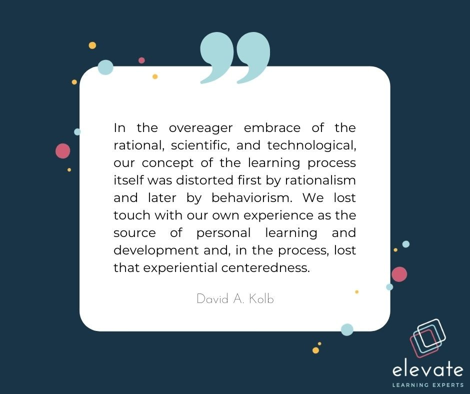
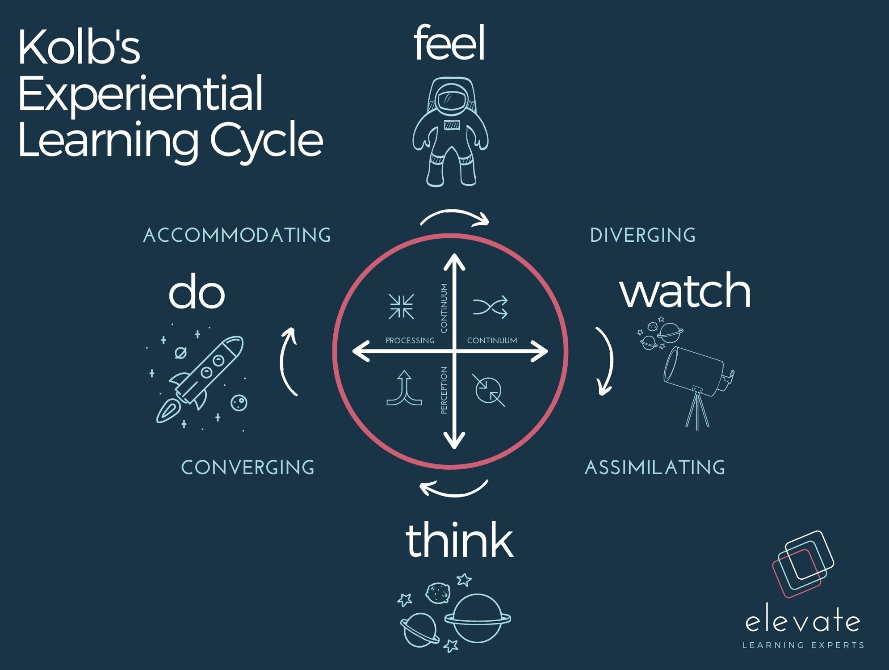
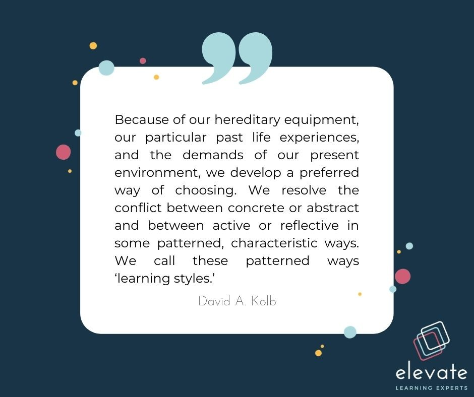

Josh Bersin, renowned learning and development and global HR leader, coined the phrase [‘learning in the flow of work’](https://joshbersin.com/2018/06/a-new-paradigm-for-corporate-training-learning-in-the-flow-of-work/) as a consequence of trends in corporate learning that called for less time in the classroom (virtual or otherwise), and more time applying new tools, skills and knowledge to actual work, a concept not dissimilar to David Kolb’s 1984 research on experiential learning. Kolb, an American psychologist and educational theorist, expanded on the work of Dewey, Piaget and Lewin, who all spent much of their research efforts across the decades understanding human behaviour, cognitive development and learning.

Dewey (1938) specifically looked at learning as a continuous flow of experiences, espousing that experience, inquiry and reflection are key components of experiential learning. Piaget (1999), emphasises learning as a lifelong process of discovery, assimilation and accommodation of learning, while Lewin (1957) explored the idea of action research through community problem solving.

Combined, Kolb theorised and proposed a framework for experiential learning that has proliferated the internet and most training and development programmes as a prerequisite for determining the success of a learning programme. Its popularity is due, in part, to the fact that it merges these theories into a neat and simple framework. While the learning process for individuals is complex, Kolb’s model seeks to combine cognitive and behavioural science to more holistically incorporate an individual’s experience, environment and emotional processing abilities to explain how we learn.

It goes without saying that the extent to which our personal contexts play a role in the ways in which we acquire and assimilate knowledge is complex, but it is worthwhile unpacking the continuums he proposes to understand how to better design learning experiences that are personalised, goal-oriented and user-centered.

## Kolb’s Experiential Learning Model

Kolb developed a cyclical continuum through which learners feel, watch, think and do in order for effective learning to take place. This approach to learning sees the integration and embedding of knowledge, competencies, and skills habitually and continuously into the learners’ everyday contexts — much like Bersin’s learning in the flow of work. In order for learning or experiences to transfer to understanding, we must go through the process of grasping and transforming experiences through four phases: Concrete Experience (Feel), Reflective Observation (See), Abstract Conceptualisation (Think) and Active Experimentation (Do).

### Feeling

Kolb describes this phase of learning as immersion in the concrete, tangible aspects of the skill or content we are learning — fully experiencing the new knowledge, behaviour or skill. For learners who value this phase, LXD should be utilised to create interactive, immersive experience tasks and learning programmes. This could be done through gamification, assessments, simulations, and community discussion and collaboration.

### Watching

Through Reflective Observation learners transform or process their experience by carefully watching others who are involved in the experience and then reflecting on what happens. Kolb explores the idea that at some stage within the learning cycle, we visually see and experience the skill, content or expression of knowledge in action, and that this plays a part in forming comprehension and understanding. Using LXD to visually aid the transformation of learning through the effective design, videos or visual elements, where learners can see the skill or content come to life, or by observing others, will result in more impactful return on learning.

### Thinking

Abstract conceptualisation is when learners, “perceive, grasp, or take hold of new information through symbolic representation — thinking about, analysing, or systematically planning, rather than using sensation as a guide” (Kolb, 1999). During this phase, learners mull over the content, investigate it within their own minds, come to conclusions, develop theories and perspectives and begin to grasp and comprehend the experience as knowledge. LXD should allow for reflection on the content learnt and create prompts for learners to dig deeper within the context of the topic.

### Doing

Active Experimentation is the phase in which learners move to action, taking on the content or practicing the new behaviour or competency for themselves. Some learners will begin with this phase and copy immediately after observing, and repeat this phase until they have mastered it, while using the thought, sight and feeling phases to alter their ‘doing’. Some learners will go through all three of the previous phases before entering into the doing phase and only try to embody the skill once they feel they have mastered all other aspects.

Collectively, these four phases result in the transformation of experience into understanding. One can start at any of the phases, and continue to cycle through them, deepening the level of comprehension and practice to achieve mastery. A good way to ensure the desired content, skill or concept is truly learnt is to embed learning experiences into everyday life through doing, or by learning in the flow of work. By choosing a goal, conducting research, deciding on milestones and asking for feedback, you are able to implement the doing phase of learning into your everyday activity, thus reaping the rewards of learning without diverging much from your everyday tasks.

### Understanding Learning Preferences

Another dimension to Kolb’s theory is that of learning styles. While the popularised idea of learning styles aligned to our physical senses is much debated, Kolb makes the case for learning styles that speak to patterned ways of being — and that we each have a preferred phase of the four.

Kolb suggests that these preferences build on Jung’s personality theory, which emphasises the ways in which we interact and engage with the world. Whether the naming conventions or simplification of these preferences is necessarily right or wrong is not the primary objective of this post, and much like the ways in which Meyers Briggs personality tests and the introversion/extraversion debates continue, their popularity remains because of our inherent nature to box ourselves according to identifiable characteristics or traits. Either way, we naturally develop individual modes of learning through our experience of it, engaging with new information or knowledge, processing and applying that information and acquiring or embedding new competencies.

This personalisation of learning, not just in terms of content, but also in delivery and design, is important to creating a culture of learning in the flow of work because it emphasises that our day to day jobs are unique because of our individual perspectives, experiences and preferences. What this means is that the key to learning in the flow of work is personalised microlearning, and easy access to just-in-time information, knowledge and learning experiences, delivered via adaptive and intuitive learning experience platforms and continuous feedback loops. It also implies an approach to learning across the organisation that prioritises informal and ongoing learning as a natural and necessary part of the work day.

With each new model, framework or theory of learning, what becomes increasingly apparent is that learning anything new is a complex and multifaceted process, and gaining an awareness of how we engage with new information, as well as how we interact with others around new knowledge is both a science and an art, which learning experience designers aim to balance through strategic, deliberate learning design that caters to a wide range of preferences — synthesising and reorganising information, putting abstract concepts into practice, and allowing for regular reflection and opportunities to think more deeply. And much like most new models or frameworks (along with their critiques), should probably be taken with a pinch of salt.

### References

_Bersin, J. 2018. A New Paradigm for Corporate Training: Learning in the Flow of Work. Available:_ [https://joshbersin.com/2018/06/a-new-paradigm-for-corporate-training-learning-in-the-flow-of-work/](https://joshbersin.com/2018/06/a-new-paradigm-for-corporate-training-learning-in-the-flow-of-work/)

_Dewey, J. (1938). Experience and education. New York: Colliers Book._

_Kolb, D. A. (1984). Experiential learning: Experience as the source of learning and development. Englewood Cliffs, N.J.: Prentice-Hall._

_Piaget J. (1999). The psychology of intelligence. London: Routledge._

_Kolb, D. 1999. Experiential Learning Theory: Previous Research and New Directions. Available:_ [https://learningfromexperience.com/downloads/research-library/experiential-learning-theory.pdf](https://learningfromexperience.com/downloads/research-library/experiential-learning-theory.pdf)

_Lewin, K. (1946). Action research and minority problems. Journal of Social Issues, 2, 4, 34–46._
