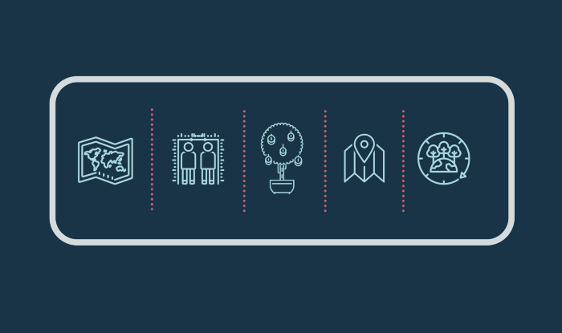
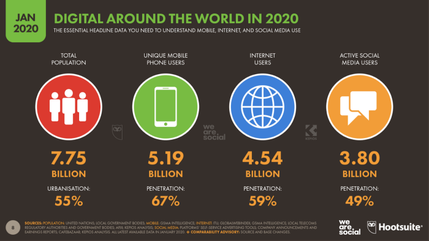
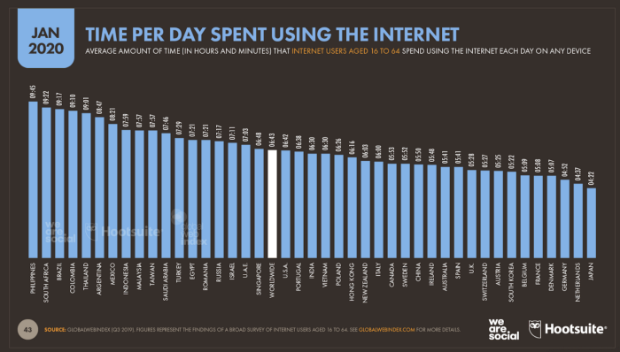

**Or, how to motivate your boss, Board, or budget-holders to go digital.**

With most organisations increasingly adapting their workplace strategies to encourage flexible working hours and work-from-home policies, trying to herd everyone into a physical classroom is not only challenging logistically, but will likely be met with some resistance on the part of the attendees. It goes without saying that in our current climate, embedding digital learning experiences into your current training agenda is a necessity, rather than an option.

Digital doesn't mean simply delivering the same face-to-face workshop virtually; it is about redesigning the learning experiences altogether. If you’ve read our previous article, “What is LXD?”, you’ll know that the modern-day learner is most effectively engaged when learning experiences are personalised, goal-oriented and design-focused. Blended and digital modes of learning are ideal conduits for delivering LXD-based learning interventions because they seamlessly embed these key elements as part of the learning experience.

Here are five reasons why you should create Digital Learning Experiences as you plan your next orientation, training manual, course, or virtual masterclass, or if you’re already onboard, how to convince your Board, Finance Team or other stakeholders hesitant to ‘go online’.

## 1) Digital is Scalable

The annual wearesocial and Hootsuite study of global digital trends shows that at the start of 2020, more than 4.5 billion people had access to the internet. Understandably, not all 4.5 billion of these internet users are exclusively engaged in online learning, however, Forbes predicts the Edtech industry will reach $252 billion in 2020, a sure indication of the scale and opportunities that online learning offers organisations and businesses alike.

This level of access is important because it highlights how the internet offers reach beyond the physical limitations of a classroom. Creating learning experiences that cross technological and geographical borders, means your content is accessible far more easily than if you were training in person. Additionally, you’re not restricted to the physical capacity of a room or a trainer’s ability to facilitate a certain number of attendees, which means more effectively training individuals and fewer budgetary constraints.

Because digital learning can withstand growing numbers without the accompanying growing budget, you can reach more people more easily. Coupled with increasing accessibility to mobile-friendly online lessons and interactive content, whether your learners are on the road, working remotely or even internationally, you can be assured of the consistency of training at scale.

<figure>
  
  <figcaption>
    wearesocial and Hootsuite release an <a href="https://datareportal.com/reports/digital-2020-global-digital-overview" rel="noopener nofollow">annual digital trends report</a> which provides insightful global digital trends data and statistics.
  </figcaption>
</figure>

## 2) Digital is Measurable

Knowing that going online is scalable is only effective insofar as you can equally measure its impact. With advancements in the merging of the worlds of technology and learning sciences merge, we’re better able to capture data, preferences, insights and progression in real-time, compared with traditional modes of teacher-led classroom-based learning, followed by a restricted, time-based assessment or exam.

While not everything that is managed can be measured, or what is measured should be managed, with more accurate data, analytics and insights into how each learner is experiencing or developing, you’re in a better position to measure your learning return on investment. Previously-held assumptions about the effectiveness of your training can now be quantified through tailored assessments, click-through and progression rates, and continuous measurement of how engaged your learners are.

Learning analytics allows you to adapt your learning content to specific cohorts and contexts, adapting to their and your organisational needs, allowing you to continuously track and monitor engagement and performance. In future articles we’ll look at different ways of evaluating the effectiveness of your digital learning interventions, but knowing that data is being captured throughout the learning experience means you’ll have a rich and detailed story to tell about each individual and their personal development.

## 3) Digital is Cost-Effective

The aim of digital LXD is to create resource-efficient learning experiences that most effectively embeds skills, knowledge and behaviour. In cutting content that is either unnecessary or irrelevant to certain groups or individuals, audiences are more likely to retain the right information and practically apply the relevant skills. Digital learning also doesn’t require everyone to learn at the same time or in the same place, overcoming the logistical challenges (read: costs) that come with in-person training, saving time most individuals in the knowledge economy need to produce high quality work.

In the same global digital trends, daily time spent online puts South Africa in second place at 9 hours and 22 minutes per day — almost 2½ hours above the global average. Meeting learners where they are is a critical aspect of the learning experience design process, and if they’re online, then your resources, energy and budget should ideally mirror that orientation.

Digital solves both time and financial constraints that traditional learning and development interventions pose, whilst also encouraging self-paced, personalised learning. In merging your learners’ online and offline worlds through interactive and meaningful learning experiences, you’ll create unique opportunities to capitalise on your development interventions, saving you both time and money.

## 4) Digital is Personalised

When it comes to creating digital learning experiences, the LXD process is based on three central concepts — the learner, the goals and the design. With this focus in mind, programme design is based on personal and professional needs, competence gaps and desired skills and knowledge. The learning designer uncovers the core competencies that the learning experience seeks to develop and uses a backwards-mapping process to create the best content, delivery methods, assessments and experiences to achieve these objectives, keeping the audience’s prior knowledge, ability, interests, experiences, and motivation in mind.

In addition to being personalised in terms of content, audience and objectives, digital learning extends to building unique and individualised communities. Digital allows for inclusive social learning opportunities, collaboration, peer-learning and peer-reviewing. These communities build on the success of the learning content by being both individually focused and comprised of learners with the same needs and goals, providing a bridge between formal and informal learning spaces and contexts.

## 5) Digital is Sustainable

> “The only thing that is constant is change.”

The same can be said for learning interventions, company policies, organisational culture and digital trends. At any given point, you might need to change the style, the content, or the audience your learning and development initiatives are directed at. In a traditional learning and development setting, this means sending updated or reprinted materials, or worse, gathering everyone together again to ensure more complex concepts are taught and understood.

The challenge with this approach to learning is that it’s unsustainable. Manual knowledge management and version control of content is time-consuming and an ineffective way to prioritise acquisition of new knowledge or skills. Sustainable learning is learning that lasts long after someone leaves a classroom, submits their final assessment or logs out of the online learning platform. Creating learning experiences that are sustainable means adopting a process (LXD), and mode of delivery (Digital) that makes it easy and cost-effective to update content, and adapt it for new contexts or cohorts.

Digital learning solutions allow you to do this efficiently and effectively, editing and adapting your learning content based on your organisational goals, what’s important to know, or which skills your workforce needs now. It allows you to easily adapt and iterate your training to context-specific circumstances, meaning your interventions are more sustainable over the long term than purely in-person training, building continuous learning experiences well into the future, with minimal impact on your bottom line.

## Is your mind made up?

There’s never been a better time than now to make the case for transforming your learning and development initiatives into personalised, digital learning experiences. In a world that depends heavily on time and money, creating online learning experiences that will save time, adapt through time and afford the learners personalised chunks of content to suit their personal capacities, will result in a higher return on investment and success rate. Through digital learning, not only will this return on investment be measurable but so will the learning achievements, allowing for efficient and effective learning experiences to be built and sustained in the long-run.
