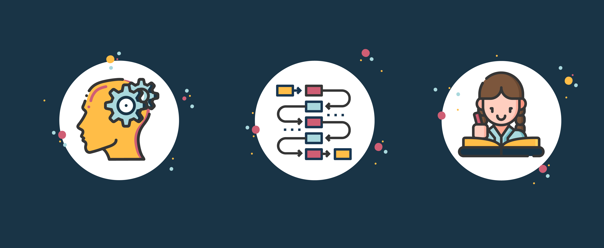
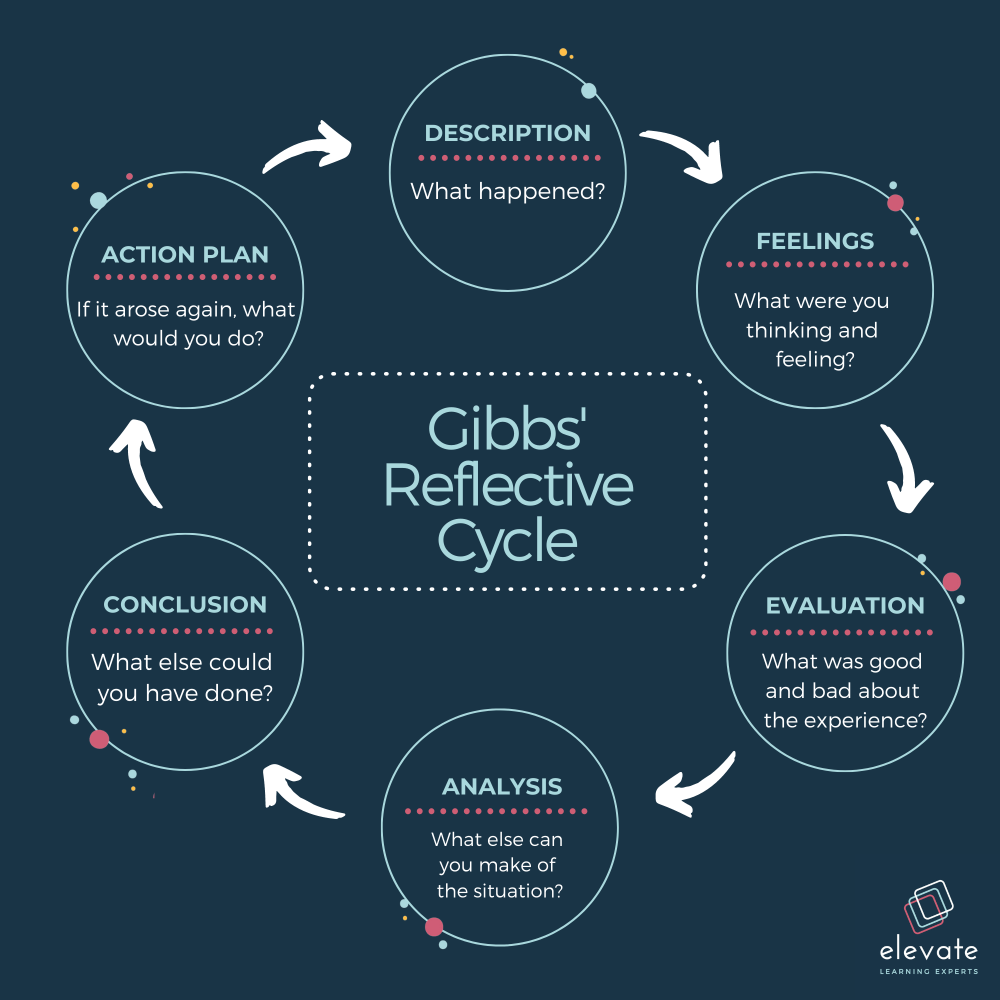
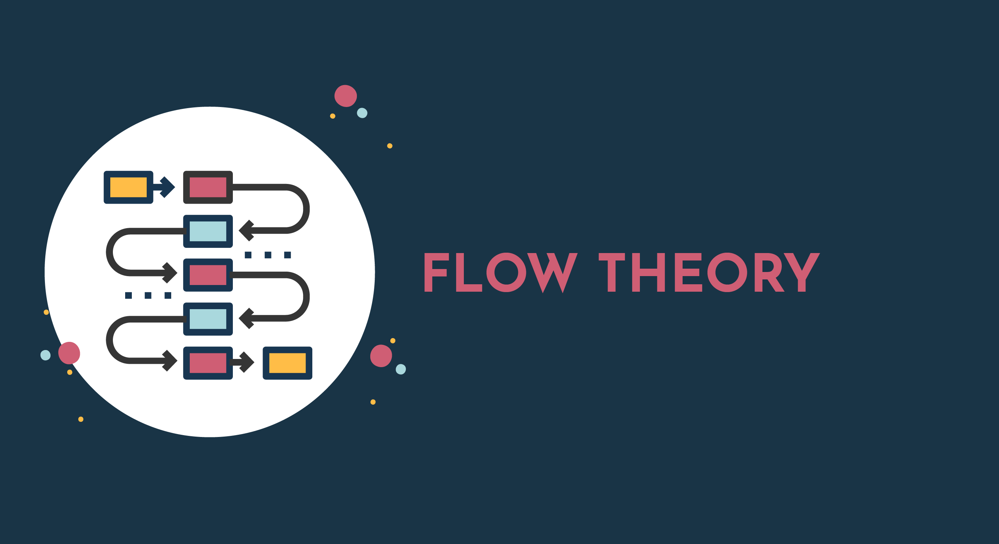
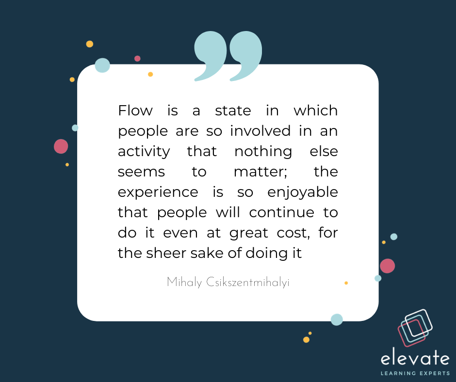
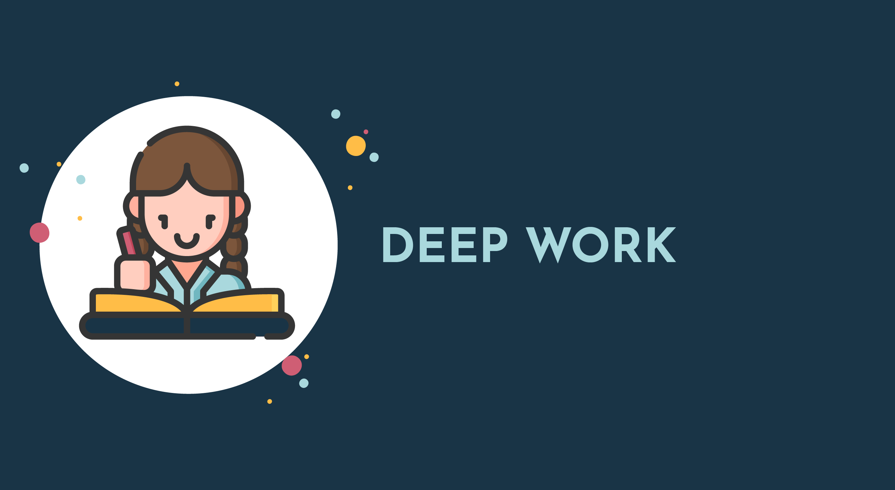

Have you ever intended to learn something new for personal or professional reasons and signed up for a free online short course only to make it halfway through? Or subscribed to newsletters from industry leaders, only to have multiple left unopened in your inbox? There can be a range of reasons as to why you weren’t able to follow through with your learning. Perhaps you had limited time in between other responsibilities, you got distracted or you had screen fatigue. The intention for professional development and learning might be there, but without the focus, necessary time set aside and most importantly knowing how to learn as an adult, this will only remain a good intention.

## Luckily, the skill of becoming a better learner can be developed over time.

There are several approaches to help you to become a better learner and which will prepare you to continually grow in your career, some of which include metacognition, self-reflection, flow theory and deep work. Let’s explore each of these in more detail.

## Metacognition and Self-Reflection

Effective learning requires conscious reflection on the act of learning itself. This in turn enables you to be self-led in prioritising your learning and to more clearly focus your attention on what you’re learning.

The practice of reflecting on the way you think and learn is called metacognition, researched by psychologist John Flavell. Metacognition provides you the cognitive strategies to better remember, analyse information and problem solve, as well as become aware of your learning preferences, an important first step in getting the most out of your learning experiences.

Metacognition encompasses two categories: knowledge and regulation.
Metacognitive knowledge helps you to distinguish between what you know and what you don’t know.
Metacognitive regulation helps you to be proactive in your learning and take the necessary actions to control your learning for your benefit.

Metacognition is an important aspect of self-regulated learning, and a key characteristic of being a lifelong learner.

Here’s how to improve metacognition by self-regulating your learning experience:

1. Understand what your learning task involves
2. Recognise your personal strengths and weaknesses related to this task
3. Create a plan for completing the task
4. Monitor the effectiveness of your plan
5. Evaluate and adjust your plan if needed

John Dewey, philosopher, psychologist and educational reformer, also made the case for reflection being a key part of effective learning experiences. Dewey defined reflection as an active process in which one recalls an experience and reflects on what the experience entailed, why things happened the way they did and what could be done differently in future. Similarly to Dewey’s research, Graham Gibbs’ six steps of reflective practice indicated in Gibbs reflective cycle below will assist you to better reflect on your experiences and turn them into learning opportunities.

Having identified how you learn, let’s look at how to approach learning without distraction. This is where flow theory comes in.

## Flow Theory

Flow theory, founded by psychologist Mihaly Csíkszentmihályi, focuses on the factors that make for a genuinely fulfilling experience, be it an activity, project or initiative. This led Csíkszentmihályi to coin the phrase ‘Flow’ - a cognitive state in which you are fully immersed in the respective experience, without distraction. Importantly, this uninterrupted immersion in the experience leads to you having heightened productivity. Csíkszentmihályi defined flow as follows:

As shown in the following image, your flow state is the fine balance between boredom and anxiety when completing a task. If the task is too much of a jump from your existing skill-set and proves very challenging, you are likely to experience anxiety and if the task is too simple or you’ve already mastered the skill, you may experience boredom. Both boredom and anxiety detract from your flow state.

Consider avid gamers who can play computer games for hours on end. They’ve reached their flow state. We can take lessons from computer games when it comes to being better learners ourselves, particularly how they captivate players in the experience, set achievable goals and incrementally add to the level of challenge as the player’s mastery improves.

Reaching your flow state will help you to have focused and satisfying learning experiences in which you are able to automate the habits or behaviours gained from the learning experience and achieve positive results that align with the learning objectives.

These five steps will help you to achieve your flow state while learning:

1. Make sure you are aware of and understand the learning experience’s goals and seek in-the-moment feedback as you learn, as and when is possible. This will help you keep on track and motivated to stay engaged in the learning experience.

2. Fully immerse yourself in the learning experience. Ensure there are minimal distractions when you learn and that you have sufficient time to complete the learning activity. Rather return to an activity when you have the time than rush through it and miss its value.

3. Aim to fully focus your attention on the activity you’re completing and become aware of the actions you’re taking or behaviours you’re demonstrating as you complete this. This will help you stay immersed in the learning experience.

4. Ensure that you are able to enjoy and be present in the immediate experience, undistracted by thoughts related to fear of failure, ambition to succeed or wondering what might be coming up next. This will also help to bring your creativity to the fore.

5. Ensure that your existing skill set is effectively balanced with the level of challenge, so you are able to achieve the learning goals. If the learning experience is too simple, seek something more challenging. If it’s too challenging, seek other learning experiences that scaffold the concepts and better prepare you for more challenging learning experiences.

## Deep Work

Deep work is another approach to concentrating on complex tasks without distraction. Computer Science Professor, Cal Newport, introduced this as a state in which one is able to dedicate sufficient time to cognitive tasks, uninterrupted by technologies such as email or social media. The opposite of deep work is shallow work, which is a series of minor tasks that fill up your work day. Shallow work can look like draft emails, several open tabs all while receiving and making phone calls throughout the day. Very few of these tasks, let alone your more complex tasks, actually get done.

Calport explains that the skill of being able to focus on cognitively-taxing tasks is one of the most valuable, as it helps people grasp complex concepts quickly and improve efficiency in performance generally. However, it is a rare skill in the modern workplace.

The following steps will help you develop the skill of deep work, which will ensure you gain the most value from your learning experiences:

## Step 1: Prepare

Identify when you are most productive in the day and set a routine or set of habits at this time to signal to your brain that you’re entering a period of deep work. For example, prepare a cup of coffee, leave your phone out of sight and open only the necessary tabs on your browser to complete the day’s learning tasks.

## Step 2: Clarify

Set a goal for your period of deep work, clarifying how it will benefit you and your organisation. It can help to reframe your learning experience in a way that solves a workplace challenge, as this gives purpose to the learning and motivates you to stay committed to your deep work.

## Step 3: Stretch

Identify small challenges within the learning experience that align with your overarching goal set in Step 2 and that will stretch you out of your comfort zone. This will help you stay on track and feel rewarded when you successfully overcome the challenges during your period of deep work.

## Step 4: Obsess

Once ready for a break from the learning experience, track how much time you spent in deep concentration. Aim to improve and extend this period over time to prolong your state of deep work.

While there are likely always going to be distractions and obstacles to learning as an adult, the approaches mentioned above should better guide you the next time you enrol in a short course or embark on a new learning journey. Good luck!