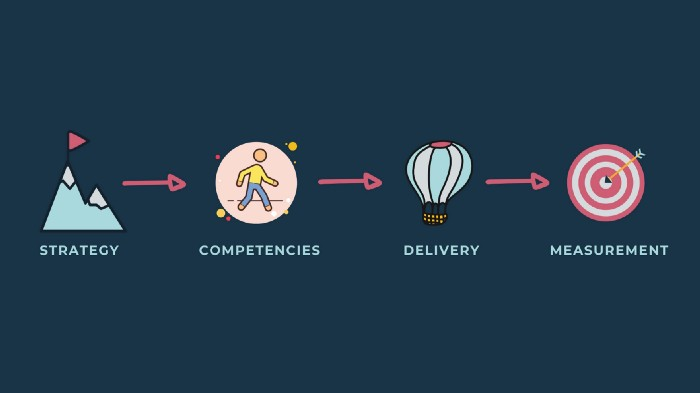
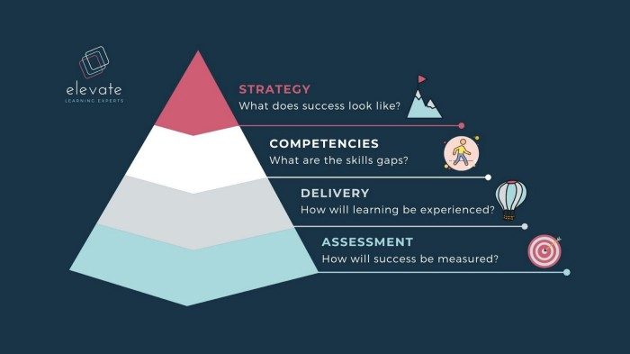
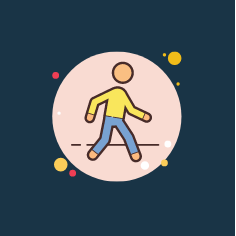

**Using competence-based LXD to meet your strategic objectives.**

Most learning and development teams are the first to feel the brunt of budget cuts, often cited as ‘nice-to-have’ rather than strategic enablers of your organisational strategy. There are plenty of reasons why learning teams have played in the shadows in the past. Sometimes it’s because there isn’t always a tangible link between the training and an organisation’s bottom line, or there are insufficient data points to measure the learning ROI. Or it’s because we’re more focused on measuring the effectiveness of a facilitator than the impact of the learning interventions, and post-workshop feedback forms get lost almost as soon as the last of the snacks has been cleared.

As you may have read in our previous article on <a href="/insights/five-reasons-why-you-should-invest-in-digital-learning" rel="noopener nofollow">why to take your training online</a>, you’ll know that digital as a mode of delivery allows you to better track and measure the success of your learning experience. Additionally, the <a href="/insights/what-is-learning-experience-design" rel="noopener nofollow">Learning Experience Design</a> process allows you to create interventions that are aligned to personal, professional and organisational goals.

At Elevate we use a 4-phase approach to designing and developing learning strategies that incorporates LXD to design and develop content, digital and blended delivery methods, and a variety of assessment tools to measure success.

In this article, we’ll explore this approach to aligning process and delivery to ensure your learning and development strategy meets your organisational objectives.

## 1. Strategy

> What are your organisational, personal or professional goals?

The first step in designing learning experiences that align to your organisational strategy is to identify the strategic goals and gaps that exist in your team’s knowledge, abilities, skills, behaviour or attitude that are preventing them from achieving those strategic goals.

One of the key characteristics of the Learning Experience Design process is that it’s goal-oriented. Knowing what organisational success looks like is essential to designing a learning and development strategy that intentionally plugs the gaps, and which achieves both personal, professional and organisational goals. For adult learners in particular, understanding the ‘WHY’ of the learning intervention (or any task or activity for that matter) is essential for participant buy-in and for sustaining motivation.

The LXD process is cyclical in nature, made up of a continuous loop of design, iteration and measurement. It requires an agile, flexible approach to curriculum and programme design that starts with deciding what the educational experience aims to provide. By starting with the end in mind, your learning and development strategy becomes a living, breathing enabler of your overarching organisational strategy, regardless of the delivery mechanism.

## 2. Competencies

> What are the key competencies needed to achieve your personal, professional and organisational goals?

Competence-based learning design is a relatively new approach to developing learning experiences. It centres on developing core skills or abilities that result in tangible outcomes and metrics for determining the success of a learning intervention. Once you’ve established the organisational goals and the key skills, knowledge or abilities needed to achieve those goals, you can design learning interventions that seek to develop those needs. Through competence-based design, these skills could include complex or abstract concepts such as problem-solving, critical thinking or emotional intelligence, or they could cover more technical or practical expertise such as coaching or management skills, compliance training or sales techniques.

The increasing popularity of designing competence-based learning experiences is that it breaks down complex concepts into relatable, demonstrable abilities in order to measure and motivate learning. This mirrors the trends in digital and blended curriculum design towards micro-, asynchronous, self-paced learning which allows users to co-create their learning experiences.

By using competence-based design, learners are able to set their own pace based on personal mastery and demonstration of the skills developed, ensuring the learning experience remains both personalised and aligned to the needs of the organisation.

## 3. Delivery

> How will the learning be experienced?

Once you’ve established your organisational and developmental goals, needs and gaps, you’ll need to determine how best to deliver the learning experience. This phase merges the art and science of the LXD process to create an educational product or user experience. It is here that learning experience designers blend concepts and subject matter expertise, graphic design and multimedia, learning science and technology platforms and systems to build learning experiences that are engaging, promotes personalised learning, and which sufficiently balance intrinsic and extrinsic motivation factors.

There are two ways of approaching delivery in the LXD process:

1. Content, themes and topics
2. Platforms, systems and facilitation

When learning designers consider content, they determine how best to curate, create and deliver content, combining subject matter expertise with experiential learning and gamification techniques, and creating opportunities to build community through social learning. When deciding on the information architecture, the thing to keep in mind is whether or not what the content and experiences will help the learner to develop the required competencies.

As the learning experience is being architected, it is also important to decide how best to deliver the experience and which platforms will best support this. As we covered in our <a href="/insights/five-reasons-why-you-should-invest-in-digital-learning" rel="noopener nofollow">previous article</a> on why you should take your training online, digital platforms and systems are one way to deliver learning experiences that ensure scalability and sustainability.

This isn’t to say that there’s no longer a place for workshops or classroom-based learning; rather the emphasis is on creating the opportunities for practical application, engagement and reflection, using various communication platforms and learning systems. In other words, systems don’t define learning design; they’re a conduit for delivering a learning experience that aims to develop competencies aligned to goals.

## 4. Measurement

How will success be measured?

Finally, having decided at the beginning of the process what success looks like and why the training is important to achieving strategic organisational goals, the last step involves creating opportunities for the competencies to be developed, as well assessing whether the learning experience has been successful in developing those competencies. While over the long term you’ll be able to attribute achieving your organisational goals in part to your learning and development strategy, you’ll need short and medium term measures of success so that you can assess and evaluate what is or isn’t working, and how to improve on the experience.

Here again there are two approaches to measuring and evaluating the impact of a learning experience — through learning activities and through an assessment of the learning experience. Through both, a learning experience designer seeks to understand how the learning content and activities develop competencies. In other words, how will the learning experience itself incorporate opportunities to develop learning competencies, and how effective has the learning experience been in delivering on its intended outcomes?

Thinking about assessments and measurement as a continuation of the learning experience helps to distinguish them as further opportunities to learn, rather than functioning simply as lower-order memory recall tests. They will also reveal whether concepts have landed and if learning outcomes have been achieved.

## Where to Start?

It’s important to see the LXD process as non-linear and occasionally a bit messy. In a perfect world where we have unlimited resources, capacity and time to co-create deeply individualised learning experiences, we’d follow this process sequentially. In reality, we’re pushed to deliver training that’s quite generic and very traditional because when we’re under pressure, we resort to what we know.

However, before you disrupt your entire learning and development, learning designers can start influencing others incrementally by asking these key questions to get to the ‘why’ of your learning experiences:

> What are our strategic objectives?
> What tasks are needed to achieve those objectives?
> What knowledge, skills or behaviours are needed to complete those tasks?
> What are the gaps between the desired and current knowledge, skills or behaviours?
> How can we best fill those gaps?
> How will we measure whether we’ve filled those gaps?

Once you’ve mapped these gaps, whether it’s at the individual, team or organisational level, you’ll be able to design and link your learning interventions to your organisational strategy more intentionally, which means you’ll be better able to measure your learning return on investment.

Understanding that each phase feeds into and informs the other is an effective lens with which to start designing a learning strategy or a learning experience, whether it’s a half-day workshop, or a full scale online academy. Through this process of merging organisational strategy, learning theory and systems design, you’ll be able to deliver impactful learning experiences with easily measured success metrics.
