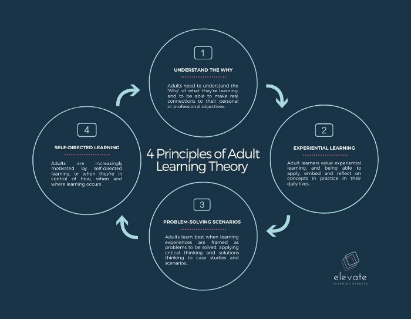

**Chunking Your Learning Content for Maximum Retention and Engagement**

Today’s learners are pressed for time, easily distracted and crave learning experiences that are relevant, applicable and practical. Irrespective of age or context, modern learning are motivated by experiences that are not only goal-oriented and personalised, but also that take into account the fact that we don’t have long leisurely days to study, or even desire the prestige of a formal academic qualification.

Microlearning aims to solve these modern-day learning challenges by offering a way to deliver content and experiences that are bite-sized, manageable and sticky.

## What is microlearning?

Microlearning is an approach to learning experience design that sees content being broken up, or chunked, into small, bite-sized units. These learning units contain just the necessary amounts of information to aid learners in achieving a desired goal, whether that’s new knowledge, a skill or the instruction to practice a new competency. Content is also structured around problem-based, decision-making scenarios or case studies that are relatable and engaging. Because microlearning portions information into easy to consume, digestible chunks, the learner can return to it as often as required, without having to invest long periods of time.

The science behind impactful and engaging learning experiences is that short, spaced, repetitive learning experiences are more effective for retention of new information. Managing for this cognitive learning load means the content and experience is scaffolded, allowing learners to slowly and incrementally build their skills and knowledge. When the content and experience is structured with microlearning in mind, information becomes easier to comprehend and retain over the long term.

## The benefits of microlearning

To understand the benefits of microlearning, it’s important to understand the principles of adult learning theory, or andragogy. While we’ll explore these principles in more depth in later articles, adult learners are most engaged in learning experiences when its design incorporates the following 4 principles:

1. Adults need to **understand the ‘Why’** of what they’re learning, and to be able to make real connections to their personal or professional objectives.
2. Adult learners value **experiential learning**, applying and embedding concepts into their daily lives.
3. Adults learn best when learning experiences are framed as **problems to be solved.**
4. Adults are increasingly motivated by **self-directed learning**, or when they’re in control of how, when and where learning occurs.

By slicing the content into shorter, easily digestible chunks of information, the learner is able to focus, comprehend, complete and retain the information in about as much time that a workshop facilitator might go over the agenda for the day. Learners can easily choose when, how and why they might select one course over another, and learning designers can design hyper-focused and practical experiences.

Learners are also able to maximise their time spent on the course by choosing bits to return to and revisit if necessary rather than forging ahead with a prescribed, time-restricted curriculum. Microlearning targets individual needs and thus sees more successful learning and retention, also benefiting those interested in the return on learning investment.

## How does this fit into the workplace?

Chief Learning Officers and Learning and Development teams are increasingly needing to see a real return on their investment through the application of newly acquired skills towards the achievement of organisational strategy. In addition, with Industry 4.0 giving us the opportunity to diversify our skill sets, or in some instances, to reskill altogether, microlearning provides effective, practical ways to acquire new competencies quickly.

This trend toward content chunking is also becoming increasingly prevalent in academic spaces, with the likes of EdX offering MicroMasters and smaller courses that build to formal qualifications. As a result, individuals are able to quickly choose from a wide array of topics, upskilling themselves without giving up the time and money that many traditional university courses demand, and gaining the practical skills to apply in their daily lives.

Combined with <a href="/insights/what-is-learning-experience-design" rel="noopener nofollow">Learning Experience Design</a>, which emphasises a learner-centered, goal-oriented approach to learning design, microlearning forces learning designers to pare down content to the essentials. It’s a problem-solving based approach that emphasises practice over theory, providing just enough practical content to stay engaged and a problem-based activity to stay motivated.

## Another Mode of M-Learning

Microlearning is partly why mobile learning has increasingly become more popular as a mode of <a href="/insights/five-reasons-why-you-should-invest-in-digital-learning" rel="noopener nofollow">delivering online learning</a>. For as long as it takes you to watch a 10-minute YouTube video, or scroll through your timelines while you’re waiting for the kettle to boil or for everyone to join a meeting, you can learn about a new skill. It allows you to maximise your time, to learn on the go and to build a culture of continuous, lifelong learning habitual.

M-learning is popular because it places the autonomy of learning back in the hands of the learner, rather than the instructor, facilitator or lecturer. Because it’s bite-sized, learners work through content at their own pace, revisiting and practicing, retaining and reflecting on their new-found competencies. This makes microlearning the ideal approach for any organisation wishing to both see a return on investment, to upskill their employees in real time, and to keep on top of industry trends.
