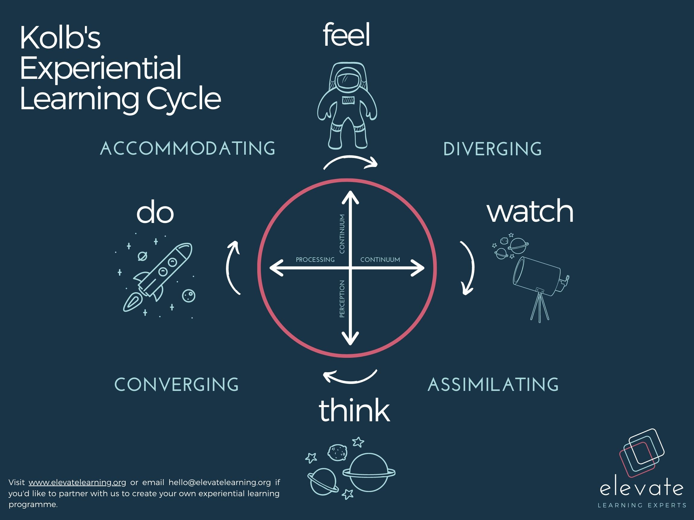
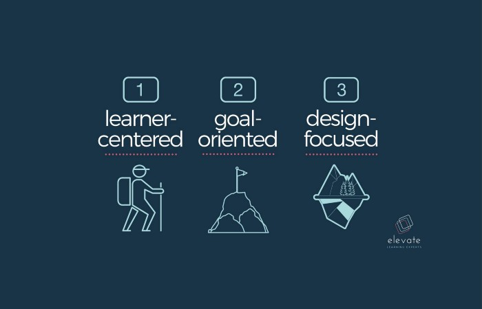

Learning Experience Design (or LXD) is a relatively new discipline within the field of learning sciences. As our understanding of teaching and learning has evolved with the introduction of educational technologies as a mode of delivery, so the discipline of Learning Experience Design is increasingly drawing on learnings from the world of user-experience design, human-centered design and co-created learning experiences.

## Lest we forget the theoretical frameworks

It is widely agreed in education circles that “learning is the process whereby knowledge is created through the transformation of experience” (Kolb, 1984, p. 38). Kolb, a psychologist and educational theorist, states that learners need to feel, watch, think, and do in order for effective learning to take place. He developed a cyclical continuum that integrates and embeds knowledge, competencies, and skills habitually and continuously into the learners’ everyday contexts.

While Kolb’s initial research is many decades old now, it’s because of recent advancements in digital learning platforms and trends that learning experience design has evolved as a complementary approach to designing impactful learning programmes. As such, Learning Experience Design has emerged as an interdisciplinary approach to creating learning experiences that most effectively and efficiently cycles through this process, resulting in maximum learning and retention.

## So, What is Learning Experience Design?

### 1. LXD is Learner-Centered.

Because learning is fundamentally human-centered, every learning experience is designed with the learner in mind. To ensure your learning interventions are effective, they should be designed with the audience’s prior knowledge, experience, abilities, and interests at the top of mind. The experience needs to be relevant and relatable to the learner, ensuring sustained interest and motivation to learn, and the difficulty level needs to sit in the sweet spot of being challenging, but within reach, balancing the cognitive load with the delight that learning something new brings.

As the emphasis shifts to the learning and the experience, the focus also moves away from teaching or facilitation. As LXD is learner-driven, the experience is personalised, adapted and tailored accordingly, moving away from the repetition of year-on-year classroom-based learning and development initiatives. Rather, it becomes an iterative co-creation process based on the needs, abilities, and experiences of the learners, and the strategic objectives and competence gaps in your organisation, resulting in a living, breathing learning framework that adapts with your audience.

### 2. LXD is Goal-Oriented.

Understanding the goals, skills, competencies and objectives you aim to achieve, whether as an individual, team, or organisation, is critical to designing effective learning experiences. With this orientation, learning experience designers analyse and embeds the desired knowledge and abilities into the design and development of the learning process, creating measurable, practical, competence-based interventions.

Competence-based learning aims to equip users with real capabilities and skills over and above head knowledge, making ambiguous or complex concepts practical and tangible through embedding and integrating the knowledge into their daily and working lives.

### 3. LXD is Design-Focused.

The idea of LXD is not simply to copy-paste your traditional classroom or workshop learning plan into an online course or to repeat the same content year-on-year, but to design unique programmes that are most effective and most conducive to learning. LXD is not one size fits all. Learning designers have the opportunity to mould and adapt their content and learning activities to suit their targeted audience needs and organisational objectives.

The design component of LXD is a creative process of ideation, iteration, application, and reflection. It is an ongoing reflection on and learning from the experiences of your audience and adapting it to continue to ensure learning potential is maximised.

## Final Thoughts

In today’s world of all-pervasive access to free content and online courses, it is useful to understand what distinguishes a great learning experience from a mediocre one, and how best to design learning experiences that develop individuals in a personalised and practical way. It’s in striking this balance between developing essential strategic and organisational competencies in a bespoke and experiential way, that LXD serves its purpose.

Ultimately, Learning Experience Design is the creation of learning content through delivery mechanisms that produce maximum learning and retention, whilst being experience-driven, audience-focused and outcomes-based. Balancing the art and science of learning, LXD provides a targeted experience for individuals to achieve maximum learning success.
